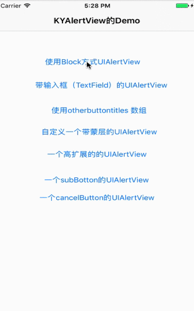
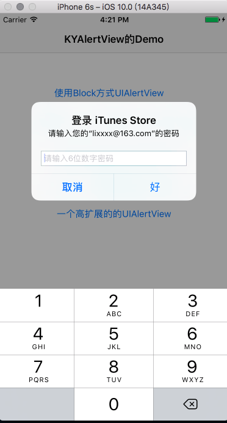
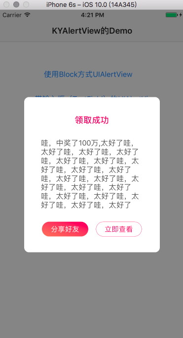
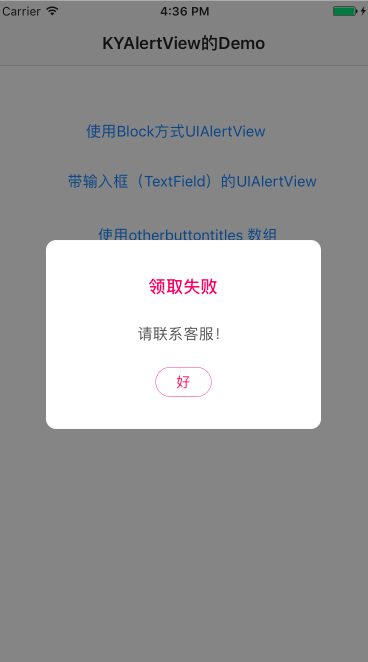
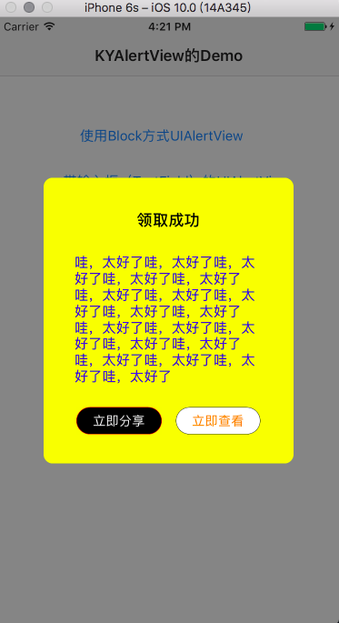

# KYAlertView
A highly customized package of AlertView, strong scalability



# 说明

KYAlertView 主要是支持block块方式的UIAlertView的扩展，支持原生的UIAlertView的`alertViewStyle`的四种样式`UIAlertViewStyleDefault`,`UIAlertViewStyleSecureTextInput`,`UIAlertViewStylePlainTextInput`,`UIAlertViewStyleLoginAndPasswordInput`,并且封装一个高自定义的UIAlertView，为了解决产品提出的不同场景的弹出层需求。

# 安装

### 要求

* Xcode 7 +
* iOS 7.0 +

### 手动安装

下载DEMO后,将子文件夹 **KYAlertViewLib** 拖入到项目中, 导入头文件`KYNetwork.h` 开始使用.
	
### CocoaPods安装

你可以在 Podfile 中加入下面一行代码来使用 KYAlertView

```
	pod 'KYAlertView' 
```

使用 `cocoaPods` 管理第三方库， 如果电脑没有安装 `cocoapods`，请先安装 `cocoapods`。安装方式可参考：[最新的cocoapods安装] (http://blog.sina.com.cn/s/blog_6ff6523d0102x8dq.html)

# 如何使用

### 使用Block方式UIAlertView


```
 UIAlertView *alert = [[UIAlertView alloc] initWithTitle:@"温馨提示" message:@"登录apple成功" delegate:nil cancelButtonTitle:@"知道了" otherButtonTitles:nil,nil];
    alert.alertViewClickedButtonAtIndexBlock = ^(UIAlertView *alert ,NSUInteger index) {

        if (index == 0) {
            NSLog(@"知道了");
        }
    };
    
    [alert show];

```

如下图所示：


### 带输入框（TextField）的UIAlertView

```
UIAlertView *alert = [[UIAlertView alloc] initWithTitle:@"登录 iTunes Store " message:@"请输入您的“lixxxx@163.com”的密码" delegate:nil cancelButtonTitle:@"取消" otherButtonTitles:@"好",nil];
    alert.alertViewStyle = UIAlertViewStyleSecureTextInput;
    [[alert textFieldAtIndex:0] setKeyboardType:UIKeyboardTypeNumberPad];
    [[alert textFieldAtIndex:0] setPlaceholder:@"请输入6位数字密码"];
    alert.alertViewClickedButtonAtIndexBlock = ^(UIAlertView *alert ,NSUInteger index) {

        if (index == 0) {

            NSLog(@"取消");

        }else  if (index == 1) {

            NSLog(@"好");

        }
        
    };
    
    [alert show];


```

如下图所示：



### 使用otherbuttontitles 数组


```
 UIAlertView *alert = [[UIAlertView alloc] initWithTitle:@"Apple ID" message:@"lixxxx@163.com" delegate:nil cancelButtonTitle:nil otherButtonTitles:@"查看 Apple ID",@"注销",@"iForgot",@"取消",nil];
    alert.alertViewClickedButtonAtIndexBlock = ^(UIAlertView *alert ,NSUInteger index) {

        if (index == 0) {

            NSLog(@"查看 Apple ID");

        }else  if (index == 1) {

            NSLog(@"注销");

        }else  if (index == 2) {

            NSLog(@"iForgot");

        }else  if (index == 3) {

            NSLog(@"取消");
        }
        
    };
    
    
    [alert show];


```

如下图所示：


### 自定义一个带蒙层的UIAlertView

```
[[KYAlertView sharedInstance] showAlertView:@"领取成功"
                                        message:@"哇，中奖了100万,太好了哇，太好了哇，太好了哇，太好了哇，太好了哇，太好了哇，太好了哇，太好了哇，太好了哇，太好了哇，太好了哇，太好了哇，太好了哇，太好了哇，太好了哇，太好了哇，太好了哇，太好了哇，太好了"
                                 subBottonTitle:@"分享好友"
                              cancelButtonTitle:@"立即查看"
                                        handler:^(AlertViewClickBottonType bottonType) {

                                            if (bottonType == AlertViewClickBottonTypeSubBotton) {
                                                NSLog(@"分享好友");
                                            }else if (bottonType == AlertViewClickBottonTypeCancelButton){
                                                NSLog(@"立即查看");
                                            }
                                        }];


```




### 一个subBotton的UIAlertView

```
    [[KYAlertView sharedInstance] showAlertView:@"领取成功"
                                        message:@"哇，中奖了100万"
                                 subBottonTitle:@"分享好友"
                                        handler:^(AlertViewClickBottonType bottonType) {

                                            if (bottonType == AlertViewClickBottonTypeSubBotton) {
                                                NSLog(@"分享好友");
                                            }
                                        }];


```


### 一个cancelButton的UIAlertView

```
[[KYAlertView sharedInstance] showAlertView:@"领取失败"
                                        message:@"请联系客服！"
                                 cancelButtonTitle:@"好"
                                        handler:^(AlertViewClickBottonType bottonType) {

                                            if (bottonType == AlertViewClickBottonTypeCancelButton){
                                                NSLog(@"取消");
                                            }
                                        }];


```




# 更多高级功能扩展

设置标题的颜色

```
 [alertView setTitleLabelTextColor:[UIColor blackColor]];
```

设置内容的颜色

```
  [alertView setContentLabelTextColor:[UIColor blueColor]]; 
```

设置AlertView的背景颜色


```
   [alertView setAlertViewBackgroundColor:[UIColor yellowColor]];
```

设置AlertView的背景图片

  
```
[alertView setAlertViewBackgroundImage:[UIImage imageNamed:@"bg_woyeyaoyugao"]]; 
```

设置SubBotton的背景颜色

```
[alertView setSubBottonBackgroundColor:[UIColor blackColor]]; 
```

设置SubBotton的文字颜色

```
[alertView setSubBottonTitleColor:[UIColor whiteColor]];
```

设置SubBotton的边框颜色


```
[alertView setSubBottonBorderColor:[UIColor redColor]]; 


```

设置CancelButton的文字颜色

```
 [alertView setCancelButtonTitleColor:[UIColor orangeColor]];

```

设置CancelButto的背景颜色

```
 [alertView setCancelButtonBackgroundColor:[UIColor whiteColor]];
```

设置CancelButton的边框颜色

```
[alertView setCancelButtonBorderColor:[UIColor blackColor]];

```

demo效果图如下：



#  联系与建议反馈

>weibo: http://weibo.com/balenn
>
>QQ: 362108564

如果有任何你觉得不对的地方，或有更好的建议，以上联系都可以联系我。 十分感谢！ 

# 鼓励

它若不慎给您帮助，请不吝啬给它点一个**star**，是对它的最好支持，非常感谢！🙏

# LICENSE

KYAlertView 被许可在 **MIT** 协议下使用。查阅 **LICENSE** 文件来获得更多信息。
 